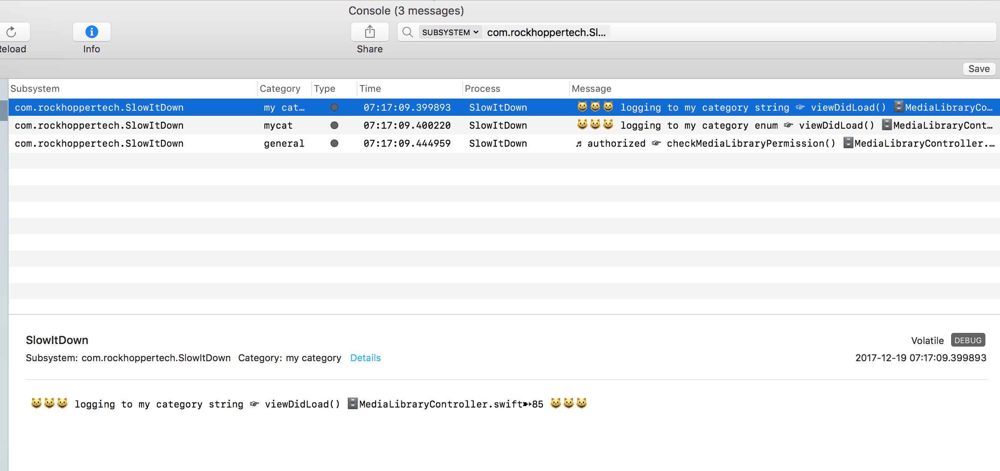

## GDLog

[](https://cocoapods.org/pods/GDLogger)
[](https://raw.githubusercontent.com/genedelisa/GDLogger/master/LICENSE)

[](https://github.com/apple/swift-package-manager)
[](https://github.com/Carthage/Carthage)
[](https://cocoapods.org/pods/GDLogger)

[](https://travis-ci.org/genedelisa/GDLogger/branches)

[](https://developer.apple.com/swift)

[](https://swift.org/)
[](https://swift.org/)
[](https://swift.org/)
[](https://swift.org/)

[](http://www.rockhoppertech.com/)
[](https://twitter.com/GeneDeLisaDev)


Yet another logger for Swift.

This uses Apple's Unified Logging `OSLog` - and `NSLog` as a fallback, so it's essentially a façade.
I think this makes `OSLog` easier to use in Swift since you can use string interpolation.

I renamed this from GDLogger since there is already a Cocoapod with that name.


- [Requirements](#requirements)
- [Installation](#installation)
- [Usage](#usage)
- [License](#license)

## Requirements

- iOS 10.0+ / Mac OS X 10.12+ / tvOS 10.0+ / watchOS 3.0+
- Xcode 9.0+

## Installation

### CocoaPods

[CocoaPods](http://cocoapods.org) is a dependency manager for Cocoa projects. You can install it with the following command:

```bash
$ gem install cocoapods
```


To integrate GDLogger into your Xcode project using CocoaPods, specify it in your `Podfile`:

```ruby
source 'https://github.com/CocoaPods/Specs.git'
platform :ios, '10.0'
use_frameworks!

pod 'GDLogger', '~> 0.0.1'
```

Then, run the following command:

```bash
$ pod install
```

### Carthage

[Carthage](https://github.com/Carthage/Carthage) is a decentralized dependency manager that automates the process of adding frameworks to your Cocoa application.

You can install Carthage with [Homebrew](http://brew.sh/) using the following command:

```bash
$ brew update
$ brew install carthage
```

To integrate GDLogger into your Xcode project using Carthage, specify it in your `Cartfile`:

```ogdl
github "GDLogger/GDLogger" ~> 0.0.1
```
### Swift Package Manager

To use GDLogger as a [Swift Package Manager](https://swift.org/package-manager/) package just add the following in your Package.swift file.

``` swift
import PackageDescription

let package = Package(
name: "HelloGDLogger",
dependencies: [
.Package(url: "https://github.com/genedelisa/GDLogger.git", "0.0.1")
]
)
```

### Manually

If you prefer not to use either of the aforementioned dependency managers, you can integrate GDLogger into your project manually.

#### Git Submodules

- Open up Terminal, `cd` into your top-level project directory, and run the following command "if" your project is not initialized as a git repository:

```bash
$ git init
```

- Add GDLogger as a git [submodule](http://git-scm.com/docs/git-submodule) by running the following command:

```bash
$ git submodule add https://github.com/genedelisa/GDLogger.git
$ git submodule update --init --recursive
```

- Open the new `GDLogger` folder, and drag the `GDLogger.xcodeproj` into the Project Navigator of your application's Xcode project.

> It should appear nested underneath your application's blue project icon. Whether it is above or below all the other Xcode groups does not matter.

- Select the `GDLogger.xcodeproj` in the Project Navigator and verify the deployment target matches that of your application target.
- Next, select your application project in the Project Navigator (blue project icon) to navigate to the target configuration window and select the application target under the "Targets" heading in the sidebar.
- In the tab bar at the top of that window, open the "General" panel.
- Click on the `+` button under the "Embedded Binaries" section.
- You will see two different `GDLogger.xcodeproj` folders each with two different versions of the `GDLogger.framework` nested inside a `Products` folder.

> It does not matter which `Products` folder you choose from.

- Select the `GDLogger.framework`.

- And that's it!

> The `GDLogger.framework` is automagically added as a target dependency, linked framework and embedded framework in a copy files build phase which is all you need to build on the simulator and a device.

#### Embeded Binaries

- Download the latest release from https://github.com/genedelisa/GDLogger/releases
- Next, select your application project in the Project Navigator (blue project icon) to navigate to the target configuration window and select the application target under the "Targets" heading in the sidebar.
- In the tab bar at the top of that window, open the "General" panel.
- Click on the `+` button under the "Embedded Binaries" section.
- Add the downloaded `GDLogger.framework`.
- And that's it!

### Other logging options.

[CocoaLumberjack](https://github.com/CocoaLumberjack/CocoaLumberjack)

[XCGLogger](https://github.com/DaveWoodCom/XCGLogger)


## Usage

[Apple's Unified Logging](https://developer.apple.com/documentation/os/logging)

To set the logging level for a subsystem.
```bash
$ sudo log config --mode "level:debug" --subsystem com.your_company.your_subsystem_name
```
For example, from the Terminal (or iterm), set the debug level for your subsystem. Then you can stream the output.
```bash

$ sudo log config --mode "level:debug" --subsystem com.rockhoppertech.SlowItDown

$ log stream --predicate 'subsystem == "com.rockhoppertech.SlowItDown"' --info --debug
```
To check the current logging level.
```bash
$ sudo log config --status
```

Use the system console (and/or Xcode's console) to read the logging messages.

You can filter by your subsystem in the Console app.

Sample Console output:




The message emojis can be redefined per level.

```Swift
var log = GDLogger()
log.debugPrefix = "♫ "
log.debugPostfix = "  ♫"
```

Here is some sample output.

```bash
2017-12-18 15:54:03.611598-0500 SlowItDown[31758:2620634] [general] 😺😺😺 authorized ☞ checkMediaLibraryPermission() 🗄MediaLibraryController.swift➸121 😺😺😺
```

Other options for creating loggers.

```Swift
var log2 = GDLogger(category: "my category")
log2.debug("logging to my category string")

public enum MyCategories: String {
case mycat
}
var log3 = GDLogger(category: MyCategories.mycat.rawValue)
log3.debug("logging to my category enum")

var log4 = GDLogger(.controller, category: .general)
log4.debug("logging to controler subsystem using general category")
````

## License

GDLogger is released under the MIT license. See [LICENSE](https://github.com/genedelisa/GDLogger/blob/master/LICENSE) for details.

